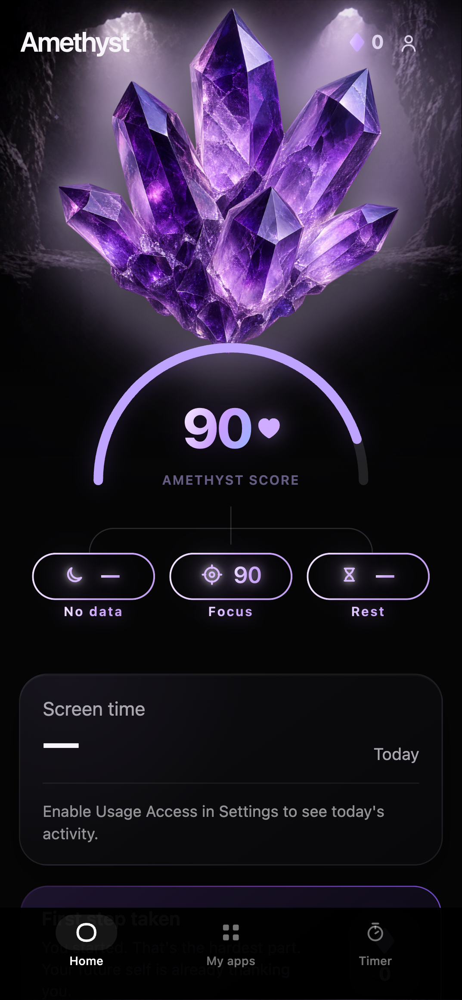
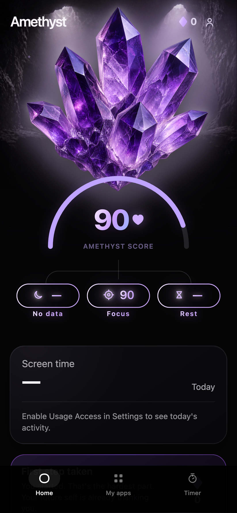

# Amethyst

> A local-first Android focus app for screen-time awareness, timed focus sessions, and app blocking, built with React + Capacitor.

[](LICENSE)
[](https://developer.android.com)
[](https://nodejs.org)
[](https://react.dev)
[](https://capacitorjs.com)

Amethyst helps you make intentional space away from distracting apps. It uses
native Android usage statistics, Accessibility-based blocking, and scheduled
rules without requiring an account or sending activity to a server.

---

## Features

- **Focus sessions** — Start timed deep-work, study, or open-space sessions with preset durations
- **App blocking** — Accessibility-based blocking overlay when a blocked app is opened during a session
- **Screen time stats** — Per-app and aggregate daily usage via Android's UsageStatsManager
- **Scheduled rules** — Minute-accurate recurring block schedules, restored on device boot
- **Streaks and scoring** — Device-only Sleep, Focus, Rest, and Amethyst scores from local usage signals
- **App rules management** — Per-app allow/block rules with category grouping
- **Onboarding flow** — Step-by-step permission grant walkthrough
- **Local-first** — No account, no server, no telemetry; all data stays on device
- **Browser dev mode** — Full UI development in-browser; native capabilities mocked cleanly

---

## Screenshots

| Home | Timer | Amethyst score | App rules |
| --- | --- | --- | --- |
|  |  |  |  |

## Install on Android

Amethyst is distributed as a signed sideload APK, not through Google Play.

1. Open the latest entry on the repository's **Releases** page.
2. Download `amethyst-v0.1.0.apk` and its `.sha256` checksum.
3. Optionally compare the downloaded APK's SHA-256 value with the checksum file.
4. Allow your browser or GitHub client to install unknown apps, then open the APK.
5. Grant Usage Access and Accessibility only if you want screen-time stats and blocking.

Notifications and exact alarms are optional unless you use reminders or scheduled
rules. You can revoke every permission later in Android settings.

---

## Requirements

| Tool | Version |
|------|---------|
| Node.js | 24 |
| npm | 10+ (use committed lockfile) |
| JDK | 21 (Android builds only) |
| Android SDK | API 36 |
| Android Studio | Optional — Gradle wrapper works standalone |

---

## Run the web app

```bash
npm ci
npm run dev
```

Open [http://localhost:5173](http://localhost:5173). Android-only capabilities are mocked or shown as explicitly unavailable in the browser.

Useful checks:

```bash
npm run lint        # oxlint
npm test            # Vitest unit/component tests
npm run test:e2e    # Playwright browser tests
npm run build       # TypeScript check + Vite production build
```

---

## Build Android locally

```bash
npm ci
npm run build
npx cap sync android
cd android
JAVA_HOME="/Applications/Android Studio.app/Contents/jbr/Contents/Home" \
  ./gradlew testDebugUnitTest lintDebug assembleDebug
```

Release builds never fall back to Android's debug key. They require the durable
private signing key described in [`docs/RELEASING.md`](docs/RELEASING.md).

Or use the npm shorthand:

```bash
npm run android:debug    # build + sync + unit tests + assembleDebug
```

---

## Project structure

```
amethyst/
├── src/
│   ├── components/      # Reusable UI components
│   ├── pages/           # Route-level screens and flows
│   ├── state/           # Client-side application state
│   ├── native/          # Capacitor plugin contracts + browser fallbacks
│   └── data/            # App catalogs and static product data
├── android/
│   └── app/src/main/    # Android activities, services, receivers, plugins
├── public/assets/       # Artwork and static web assets
├── tests/               # Playwright browser tests
├── docs/                # Architecture, permissions, security, release docs
└── .github/             # CI workflows, issue templates, PR template
```

Full architecture detail: [`docs/ARCHITECTURE.md`](docs/ARCHITECTURE.md).

---

## Sensitive Android capabilities

Amethyst declares capabilities that deserve careful review before any distribution:

| Capability | Purpose |
|-----------|---------|
| Usage Access | Screen-time statistics via UsageStatsManager |
| Accessibility Service | Blocking overlay when a blocked app is opened |
| App visibility (narrow) | Installed-app catalog for rule management |
| Notifications | Focus session start/end and block events |
| Exact alarms | Minute-accurate schedule enforcement |
| Boot completion | Restoring active schedules after reboot |

Read [`docs/ANDROID_PERMISSIONS.md`](docs/ANDROID_PERMISSIONS.md) and [`docs/SECURITY_MODEL.md`](docs/SECURITY_MODEL.md) before modifying any permission.

---

## Documentation

| Document | Description |
|----------|-------------|
| [Architecture](docs/ARCHITECTURE.md) | Runtime shape, data flow, native capability rules |
| [Android permissions](docs/ANDROID_PERMISSIONS.md) | Permission rationale and policy |
| [Security model](docs/SECURITY_MODEL.md) | Trust boundaries and known gaps |
| [Privacy and local data](docs/PRIVACY.md) | What is stored and where |
| [Release process](docs/RELEASING.md) | Signing, distribution, release gates |
| [Licensing guide](docs/LICENSES.md) | Third-party dependency license summary |
| [Asset provenance](ASSET_PROVENANCE.md) | Origin and license of all distributed artwork |
| [Brand system](docs/brand/) | Visual identity and homepage reference |
| [Changelog](CHANGELOG.md) | Notable changes by version |

---

## Project status

Amethyst `v0.1.0` is a public beta for personal sideloading. The web and Android
builds have automated coverage, and the current Android build has been checked
on a Samsung Galaxy S25. It is still early software:

- device-based score thresholds need broader, longer-term calibration;
- release publication is manual;
- the app is not a parental-control, device-management, or tamper-resistant tool;
- a full-day device soak and a wider Android device matrix are still outstanding.

See [`docs/RELEASING.md`](docs/RELEASING.md) for the full checklist.

---

## Contributing

Bug reports, design feedback, tests, and focused pull requests are welcome.

Please read [CONTRIBUTING.md](CONTRIBUTING.md) and the [Code of Conduct](CODE_OF_CONDUCT.md) first.

Changes involving Accessibility Services, app visibility, usage data, scoring, storage, or release signing require a short threat and policy note in the pull request.

---

## Security

Security reports are welcome — see [SECURITY.md](SECURITY.md) for the responsible disclosure process.

Do not open a public issue for active bypass vectors, data exposure, or exported component vulnerabilities.

---

## License

Source code is licensed under the [Apache License 2.0](LICENSE).

Original project artwork is licensed under [Creative Commons Attribution 4.0 International](https://creativecommons.org/licenses/by/4.0/), unless otherwise noted in [ASSET_PROVENANCE.md](ASSET_PROVENANCE.md). Third-party dependencies retain their own licenses.
